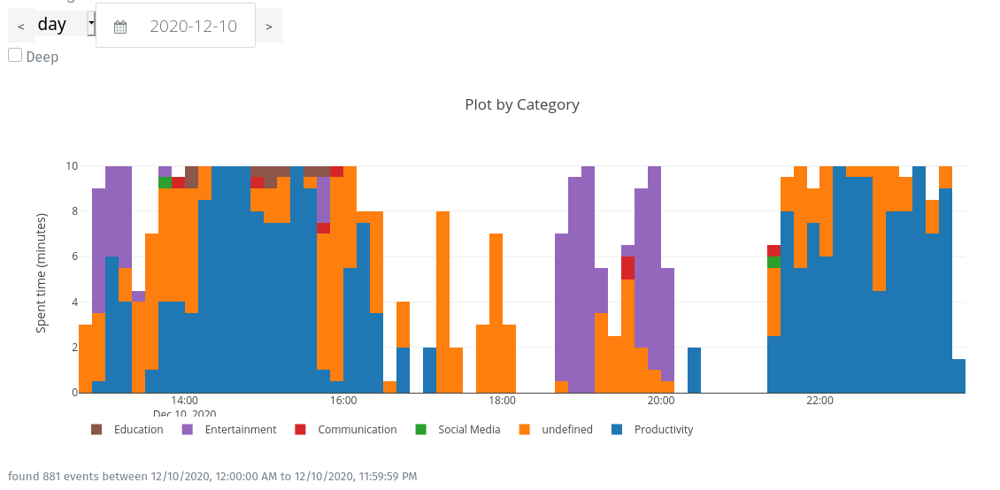
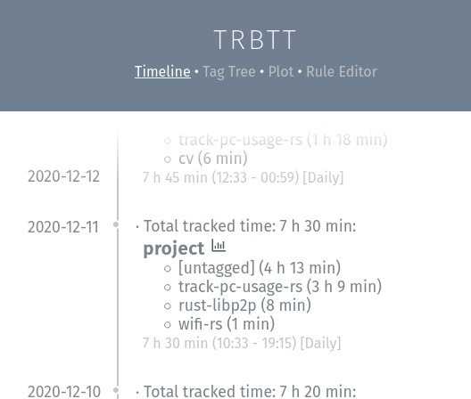
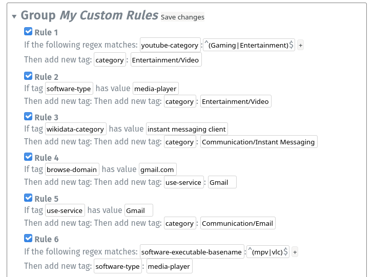

**How did you spend your day?**



**Get more detail**


**Track which projects you are working on and how much**



**Add your own custom classification rules**



# Automatic Time Tracker

track which programs is used how much and stores data in database. Inspired by [arbtt](https://arbtt.nomeata.de/), which I used previously.

## todo

-   autoimport more detailed / other data
    -   browser usage via own firefox/chrome `permanent-history-webextension`, tbd
    -   mpv usage via own mpv tracking lua script `.config/mpv/scripts/logall.lua` tbu
-   look at similar tools, e.g. https://www.raymond.cc/blog/check-application-usage-times-personal-activity-monitor/

## Ideas for getting program metadata

We currently get this metadata:

-   window title. can sometimes be configured within the program to be more expressive (e.g. browser plugin, or vscode etc. see Data Sources Setup)
-   binary name. For example /usr/bin/vlc.
-   cwd of the program

Metadata we could potentially get:

-   which files the program has open. e.g. a pdf viewer has a specific file open and that file can be used to identify what the user is working on.

    sadly only works sometimes because many programs just read the file to ram and close it.

    Tests:

    -   archive manager (file-roller): works (keeps the archive open)
    -   image viewer eog (eye-of-gnome): doesn't work. probably reads file to ram and closes
    -   video viewer vlc and mpv: works
    -   audio player: probably works
    -   pdf viewer evince: works
    -   text editor gedit: doesn't work
    -   libreoffice: works
    -   gimp: doesn't work

### External APIs

This program name can be mapped to a software package using the system package manager, example: `pacman -Qo /usr/bin/vlc`. Then that package name can be used to get metadata, for example the software homepage, tags etc.

Also, Wikidata can be used to get the software category etc: https://www.wikidata.org/wiki/Q171477

SELECT ?software ?package WHERE {
?software wdt:P3454 ?package.
VALUES ?package { "vlc" }
}

SELECT ?software ?package ?category ?categoryLabel WHERE {
?software wdt:P856 ?package.
?software wdt:P31+ ?category.
?category wdt:P279 wd:Q1668024
VALUES ?package { <https://www.reddit.com> }
SERVICE wikibase:label { bd:serviceParam wikibase:language "en" }
}

(returns Q171477)

select ?category where ?software is_in ?category and ?category subclass_of\* software_category (should return media_player and multimedia_software etc)

### Manual Entry

Alternatively there could be a UI where user's can categorize their software themselves (boring).

## Structure

## philosophy

Store as much information in an as raw as possible format in the capture step. Interpret / make it usable later in the analyse step. This prevents accidentally missing interesting information when saving and can allow reinterpretions in unexpected ways later. Redundancies in the data which cause large storage requirements will be solved with compression later.

## todo:

remove Defaults from deserializing in x11.rs

## notes

alternatives:

-   activitywatch
-   https://www.software.com/code-time

## Data Sources Setup

### Firefox

Install https://addons.mozilla.org/en-US/firefox/addon/add-url-to-window-title/ and enable "Show the full URL"

### Google Chrome / Chromium

Install https://chrome.google.com/webstore/detail/url-in-title/ignpacbgnbnkaiooknalneoeladjnfgb?hl=en

### VS Code

Open your user settings and set `window.title` to `${dirty}${activeEditorShort}${separator}${rootName}${separator}${appName}} 🛤sd🠚proj=${rootPath}🙰file=${activeEditorMedium}🠘 `

### Shell / Zsh

Todo: look at https://arbtt.nomeata.de/doc/users_guide/effective-use.html

1. Add / Install [zsh-histdb](https://github.com/larkery/zsh-histdb)

2. Add the following to your zshrc:

    ```zsh
    # set window title for track-pc-usage-rs
    # adopted from https://github.com/ohmyzsh/ohmyzsh/blob/master/lib/termsupport.zsh
    autoload -Uz add-zsh-hook

    function title_precmd {
        title_preexec '' ''
    }
    function title_preexec {
        # http://zsh.sourceforge.net/Doc/Release/Expansion.html
        # http://zsh.sourceforge.net/Doc/Release/Prompt-Expansion.html#Prompt-Expansion
        local cwd="$(print -P '%~')"
        local user="$(print -P '%n@%m')"
        local LINE="$2"
        local cmd="$(print -P '%100>...>$LINE%<<')"

        title '' '{"t":"shell","cwd":${(qqq)cwd},"histdb":$HISTDB_SESSION,"usr":${(qqq)user},"cmd":${(qqq)cmd}}'
    }
    add-zsh-hook precmd title_precmd
    add-zsh-hook preexec title_preexec

    ```

## Compression notes

Finish and make use of https://github.com/phiresky/sqlite-zstd. Then redundancy in the stored raw events should become basically irrelevant.

Compression benchmark:

```
for id in $(sqlite3 activity.sqlite3 "select id from events where data_type='x11'"); do sqlite3 activity.sqlite3 "select data from events where id='$id'" > "x11/$id.json"; done
```

Zstd test: 7400 x11 events rows:

-   202M uncompressed (27kB avg)
-   21M compressed without dictionary (2.8kbyte avg)
-   20M compressed with `xz -9`
-   5.0M compressed with generated dictionary (675byte avg), 110KB dictionary-file (which is default --maxdict)
-   12M compressed with random sample json file as dictionary (1.6kbyte avg)
-   11M compressed with dict generated 100 random json files (20kb dict file)
-   2.7M compressed with large dict, 1MB dict file size (--maxdict=1000000)
-   1.9MB as single file: `zstd -19 all`
-   1.6MB as single file: `zstd --ultra -22 --long=31 all`
-   1.3MB as single file (ordered by date) `-19`
-   1.3MB as single file (ordered by date) `--ultra -22 --long=31`

Conclusion: zstd is awesome
